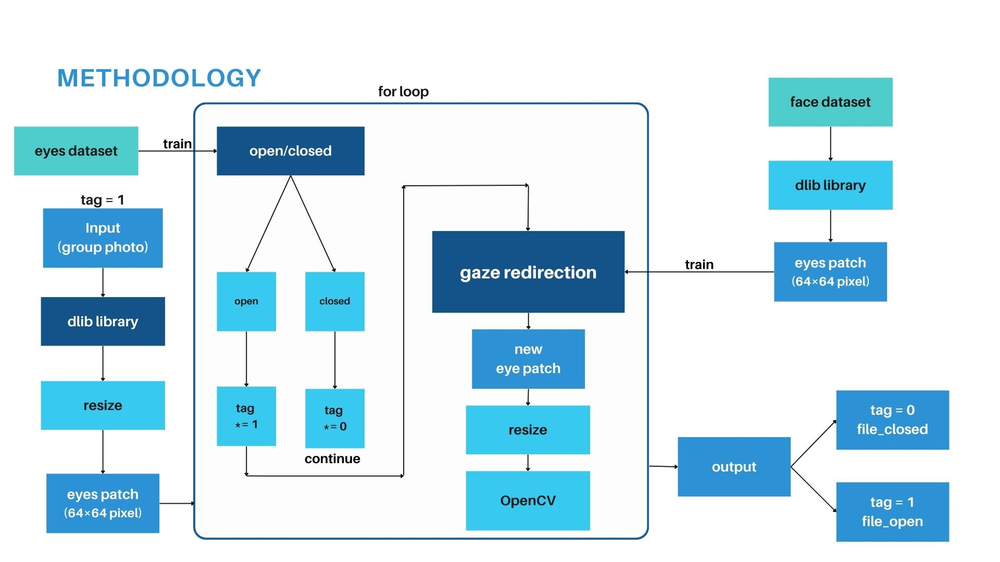
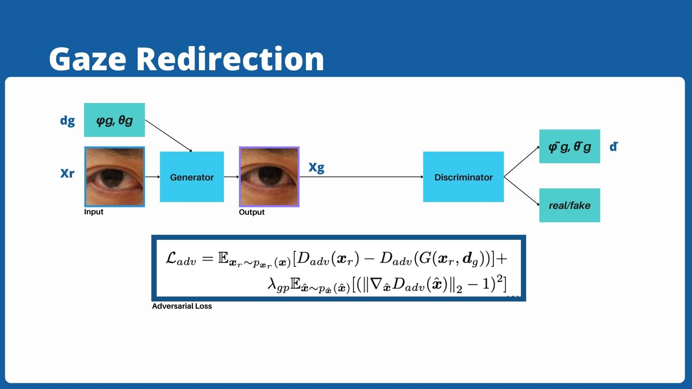
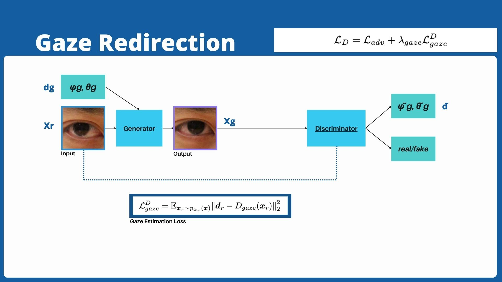
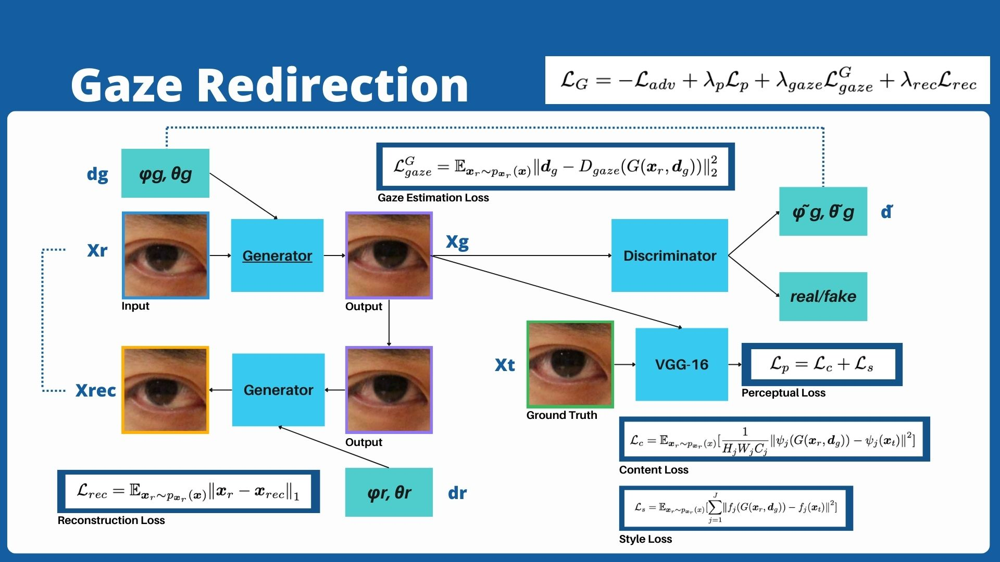
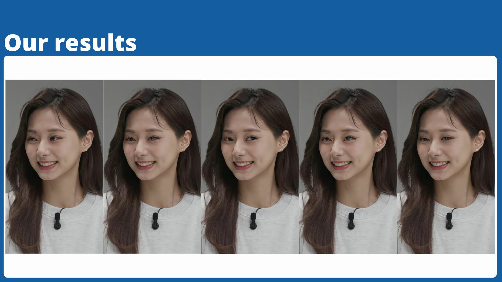
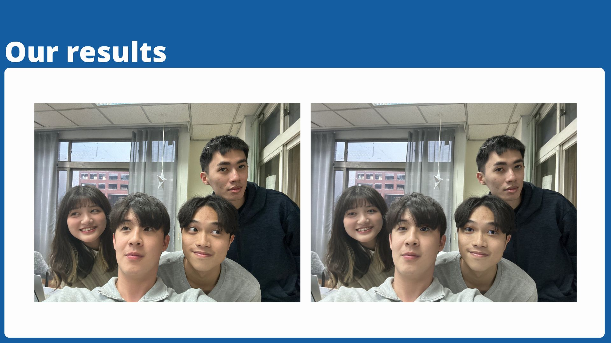

## Reference Paper
**Photo-Realistic Monocular Gaze Redirection Using Generative Adversarial Networks** <br />
[[paper](https://arxiv.org/abs/1903.12530)]

The original paper implemented the model using TensorFlow 1.7. Since many functions are no longer supported in current versions, I decided to reimplement the gaze redirection model using PyTorch.

## Dependencies

Python == 3.10.15 <br />
torch == 2.5.1 <br />
dlib == 19.24.6 <br />
pillow == 10.4.0

## Methodology



**Pre-setup and Training Phase**
- Set the **dlib** criteria for determining open and closed eyes
- Use a facial dataset to create eye patches using **dlib** and train the model

**Usage Phase**
- Extract eye patches from individual faces in multiple group photo using dlib and resize them.
- Determine if the eyes are open or closed.
  - If everyone in the photo has their eyes open, perform gaze redirection and copy the image to the usable photo folder.
  - If anyone in the photo has their eyes closed, treat the photo as NG (not good) and move it to a separate folder.

## Loss Design




## Results




**Trained weights file**: [[click here](https://drive.google.com/drive/folders/1Md5oNycrS5r_NYJDeZUW563aTzxzMaH6?usp=drive_link)]

## Dataset
**Original dataset**: [[click here](https://www.cs.columbia.edu/~brian/projects/columbia_gaze.html)] <br />
**Preprocessing dataset**: [[click here](https://drive.google.com/drive/folders/1Lk9xDfrK0lsB4I7zJ1Psonx0FDsD0eaZ?usp=drive_link)]

## Train

```Bash
python main.py --mode train --data_path /home/andy/AILab/AIfinal/pytorch_gaze_redirection/eyespatch_dataset --log_dir ./log/ --vgg_path ./vgg16_reducedfc.pth
```

## Use the model
```
python main.py --mode eval --client_pictures_dir ./client_pictures/ --log_dir ./log/
```

## VGG16 pretrained weights
```Bash
wget https://s3.amazonaws.com/amdegroot-models/vgg16_reducedfc.pth
```

<!--
## Push
```
git push -u origin
```
### if "rejected because the remote contains work that you do not have locally."
```
git pull --rebase
```
-->
