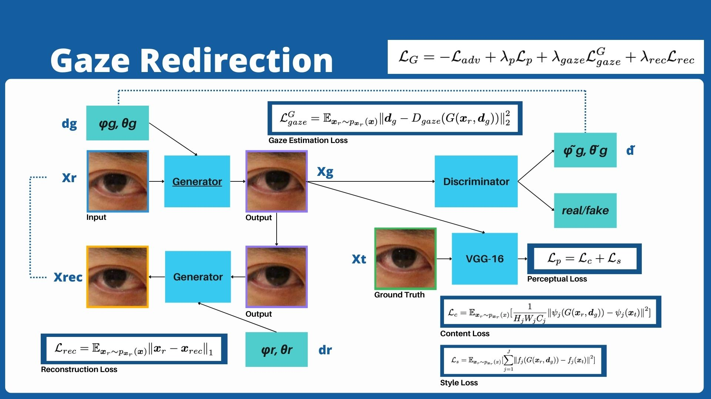

## Reference Paper
**Photo-Realistic Monocular Gaze Redirection Using Generative Adversarial Networks** <br />
[[paper](https://arxiv.org/abs/1903.12530)]

The original paper implemented the model using TensorFlow 1.7. Since many functions are no longer supported in current versions, I decided to reimplement the gaze redirection model using PyTorch.

## Dependencies

Python == 3.10.15 <br />
torch == 2.5.1 <br />
dlib == 19.24.6 <br />
pillow == 10.4.0

## Methodology




## Train

```Bash
python main.py --mode train --data_path /home/andy/AILab/AIfinal/pytorch_gaze_redirection/eyespatch_dataset --log_dir ./log/ --vgg_path ./vgg16_reducedfc.pth
```

## Use the model
```
python main.py --mode eval --client_pictures_dir ./client_pictures/ --log_dir ./log/
```

## VGG16 pretrained weights
```Bash
wget https://s3.amazonaws.com/amdegroot-models/vgg16_reducedfc.pth
```

## Push
```
git push -u origin
```
### if "rejected because the remote contains work that you do not have locally."
```
git pull --rebase
```
